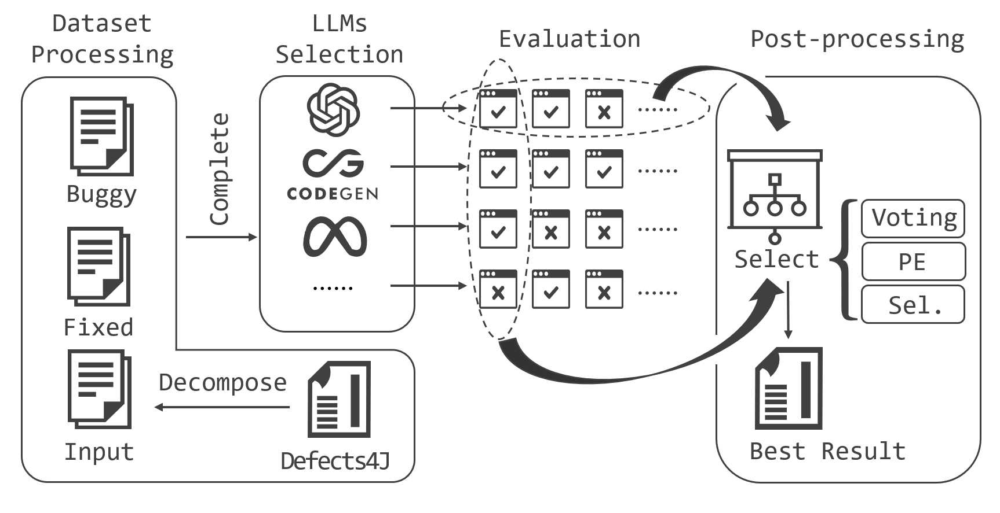
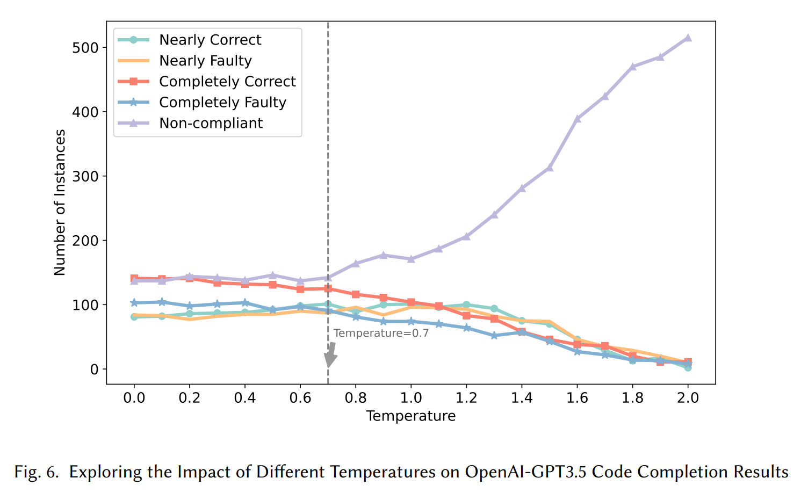
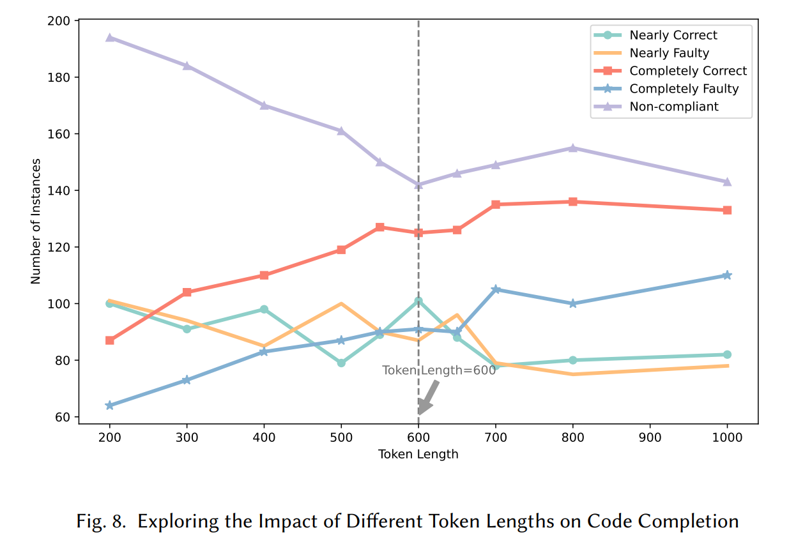

# When Large Language Models Meet Fragile Code Completion

The code for 'When Large Language Models Meet Fragile Code Completion' paper.




**Table of Contents**

1. [Introduction](#when-large-language-models-meet-fragile-code-completion)
2. [Installation Requirements](#installation-requirements)
3. [Adding a Configuration File](#adding-a-configuration-file)
4. [Dataset Download](#dataset-download)
5. [Dataset Processing](#dataset-processing)
6. [Research Questions 1](#rq1)
   - [Impact of Different Temperatures on GPT3.5](#exploring-the-impact-of-different-temperatures-on-openai-gpt35-code-completion-results)
   - [Impact of Different Temperatures Across LLMs](#exploring-the-impact-of-different-temperatures-on-code-completion-for-different-llms)
   - [Impact of Different Token Lengths on Code Completion](#exploring-the-impact-of-different-token-lengths-on-code-completion)


## Installation Requirements

This project uses Python 3.10.

```bash
pip install -r requirements.txt
```

## Adding a Configuration File

Add a `config.yml` configuration file in the project's root directory and fill in the necessary information for the experiment, such as the keys for OpenAI and Hugging Face.

```yml
config:
  dataset_path: C:\happen\dataset\completeOutput
openai-gpt3:
  api_base: https://api.openai.com/v1
  api_key: sk-xxx
huggingface:
  key_list:
  - hf_xxx
  - hf_xxx
```

## Dataset Download

In our study, we only used the defect data and the corresponding correct data from Defects4J. To facilitate the experiments, we organized the data from Defects4J, collated all versions of the code files, and uploaded the processed files to Google Drive. The download link is as follows: https://drive.google.com/file/d/1muZd69BWFz4nRNvbIjA5BuvvQVwLBhb-/view?usp=drive_link

Then unzip the data and ensure that the `dataset_path` specified in the `config.yml` file corresponds to the actual location where the data is stored after extraction.

## Dataset Processing

Run the `1.view_the_decompose_dataset.py` script to process the dataset and view the results according to the "Study Design > Dataset" section of the paper. The processed results will be cached in the project directory's cache folder. To reprocess the data, simply delete this folder.

## RQ1

### Exploring the Impact of Different Temperatures on OpenAI-GPT3.5 Code Completion Results

> Note: This process will call the OpenAI GPT3.5 API over 10,000 times. For testing, you can modify the number of datasets returned by the `get_huge_code_list` function in `get_dataset/__init__.py` to a smaller set for testing purposes. After making changes, you need to delete the `cache` directory or just the `temp` folder below.

1. Modify the `config.yml` file to add the `api_key` for `openai-gpt3`.

2. Run the script `2.RQ1_Impact_of_Temperatures_on_GPT3.5_Code_Completion_Results.py` to see results similar to those depicted in the paper.




### Exploring the Impact of Different Temperatures on Code Completion for Different LLMs

> Note: This process will call the OpenAI GPT3.5 API over 10,000 times and the HuggingFace API over 40,000 times. For testing, you can modify the number of datasets returned by the `get_huge_code_list` function in `get_dataset/__init__.py` to a smaller set for testing purposes. After making changes, you need to delete the `cache` directory or just the `temp` folder below.

1. Modify the `config.yml` file to add the `key` for `huggingface`.
2. Run the script `3.RQ1_Explore_Temperature_Impact_on_Code_Completion_Across_LLMs.py` to examine the impact of different temperatures on code completion across various LLMs as discussed in the paper.


### Exploring the Impact of Different Token Lengths on Code Completion

> Note: This process will call the OpenAI GPT3.5 API over 5,000 times.

1. Modify the `config.yml` file to add the `api_key` for `openai-gpt3`.

2. Run the script `4.RQ1_Explore_Impact_of_Token_Lengths_on_Code_Completion.py` to examine the impact of token lengths on code completion.


